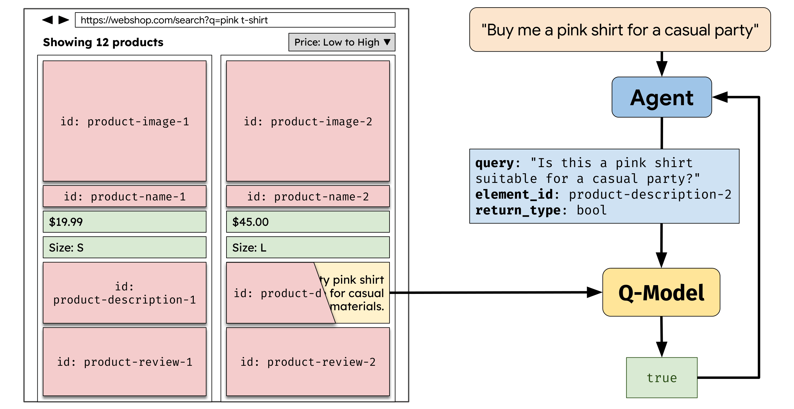

# Untrusted Content Masking for Web Agents with Security Guarantees

Kristina Nikolić*, Egor Zverev*, Javier Rando, Matthew Jagielski, Edoardo Debenedetti, and Florian Tramèr.

## Overview



**Untrusted Content Masking (UCM)** is a defense against prompt-injection
attacks on web agents. It relies on DOM labels to separate trusted regions from untrusted regions (reviews, comments, ads) without reading their text. Before the page reaches the Agent, every untrusted region is replaced with a labeled placeholder, so the Agent never observes attacker-controlled content. When a task genuinely needs information from a masked element, the Agent
calls a **Quarantined Model (Q-Model)** with an element ID, a natural language question, and a restricted return type (bool / int / float / enum / date); the Q-Model reads the hidden content and returns a
type-constrained answer that cannot carry injected instructions back to the Agent.

What's in the codebase:

- **[Custom websites with UCM](#custom-websites-10-self-hosted-sites)** — UCM
  applied to 10 self-hosted interactive websites spanning common domains (banking, calendar, customer-support, e-commerce, email, forum, job-board, restaurant, travel-booking, wiki).
- **[WebArena GitLab with UCM](#webarena-gitlab)** — UCM applied to the WebArena GitLab benchmark.
- **[WASP attack evaluation](#wasp-attack-experiment)** — seeded prompt-injection attack tests against UCM.
- **[Automated boundary identification](#automatic-boundary-detection)** — LLM-based trust-boundary inference for unlabeled pages.

## Setup

Prerequisites:

- **Docker and Docker Compose** — for the agent container and the website  
containers.
- **Python 3.11+** and the [uv](https://github.com/astral-sh/uv)  
package manager.

### 1. Python dependencies

```bash
uv sync
uv run playwright install chromium   # browser for the boundary-detection pipeline
```

### 2. API keys

```bash
cp .env_example .env
# then edit .env
```

- `ANTHROPIC_API_KEY` — your key.
- `OPENAI_API_KEY` — only needed if you use the GPT-5.4 agent
  (`--provider openai`) or the OpenAI LLM judge (`--llm-judge openai`).

The other `GITLAB_*` vars in `.env_example` are only needed for the WebArena
/ WASP runners — see [the WebArena setup](#webarena-gitlab) below.

### 3. Build the agent container

Required on first run (and after editing the agent `Dockerfile`):

```bash
docker compose build agent
```

The website containers (`forum`, `banking`, …, `vwa_gitlab_nginx`) are
built on demand the first time you start them.

---

## Environments

There are two evaluation environments —
[custom websites](#custom-websites-10-self-hosted-sites) and
[WebArena GitLab](#webarena-gitlab) — with docker contexts and runtime
assets under [`environments/`](environments/).

### Custom websites (10 self-hosted sites)

Each of the 10 custom sites lives under
[`environments/custom_websites/<site>/`](environments/custom_websites/).

- **Client-side app** — HTML + JS + CSS served by Nginx, with all data
baked into the JS. Pages are fully interactive but there is no database, so reloading the page resets all state.
- **Untrusted elements are pre-labeled** in the HTML (via `data-`*
attributes on user-generated content).
- **Sites:** `banking`, `calendar`, `customer-support`, `ecommerce-search`, `email`, `forum`, `job-board`, `restaurant`, `travel-booking`, `wiki`.

Build a site image (only needed if you change its files — first run will
pull images on demand):

```bash
docker compose build forum
docker compose build banking
# ...
```

Start a site manually (the runner also starts them on demand):

```bash
docker compose up -d forum     # http://localhost:8100   (http://forum.com    from agent)
docker compose up -d banking   # http://localhost:8093   (http://banking.com  from agent)
docker compose up -d email     # http://localhost:8095   (http://webmail.com  from agent)
# ... see docker-compose.yaml for the full port + hostname mapping
```

To add a new custom site:

1. Create `environments/custom_websites/<my-site>/` containing the static
  files and a `web.Dockerfile`.
2. Add a service for it in [`docker-compose.yaml`](docker-compose.yaml)
   (build `context: ./environments/custom_websites`,
   `dockerfile: <my-site>/web.Dockerfile`, pick a free port + IP).
3. Add task definitions in [`tasks.py`](src/benchmarks/custom_websites/tasks.py) under a new suite and group.
4. Label the untrusted elements in your HTML by adding
   `data-untrusted="true"` to every user-generated / third-party region,
   together with a short semantic name via `data-tag-name="..."` (e.g.
   `data-tag-name="review-text"` or `"advertisement-banner"`) — the
   shared `reveal/security-tracker JS` picks these up automatically and
   renders them as labeled placeholders to the Agent. See any existing
   site (e.g. [`forum/index.html`](environments/custom_websites/forum/index.html)) for examples.

### WebArena GitLab

The WebArena GitLab instance runs on **AWS**, launched from the
pre-populated AMI published by the [WebArena project](https://github.com/web-arena-x/visualwebarena/blob/main/environment_docker/README.md#pre-installed-amazon-machine-image-recommended). We access it locally through an Nginx proxy ([`environments/webarena/gitlab-setup/`](environments/webarena/gitlab-setup/)) that injects our reveal/masking JS plus [`gitlab-marker.js`](environments/webarena/gitlab-setup/nginx-files/gitlab-marker.js) — a hand-written CSS-selector config that labels which DOM regions on each GitLab page count as untrusted (issue descriptions, comments, repo READMEs, etc.).

**Step 1 — launch the AWS GitLab instance.** All subsequent WebArena
commands depend on the AWS instance being reachable. See
[the gitlab-setup README](environments/webarena/gitlab-setup/README.md) for the full walkthrough.

**Step 2 — set the GitLab env vars.** Fill in `GITLAB_BACKEND_HOST`,
`GITLAB_PUBLIC_HOST`, `GITLAB_SSH_KEY`, `GITLAB_SSH_HOST` in `.env` (documented in
[the gitlab-setup README](environments/webarena/gitlab-setup/README.md#2-configure-the-local-nginx-proxy)).

**Step 3 — start the local proxy:**

```bash
docker compose up -d vwa_gitlab_nginx
# http://localhost:8103  (http://gitlab-vwa.com from agent)
```

---

## Running tasks

Two main conditions, picked via a system prompt + reveal-mode pair:


| Condition                           | System prompt | Reveal flag        |
| ----------------------------------- | ------------- | ------------------ |
| **No defense** (baseline)           | `no_security` | `--reveal-all`     |
| **Untrusted Content Masking (UCM)** | `ucm_defense` | `--mask-untrusted` |


`no_security` lets the agent see everything; `ucm_defense` hides untrusted elements and exposes a Quarantined LLM (QLLM) tool the agent can use to safely inspect hidden content. System prompts are defined in
[`system_prompts.py`](src/system_prompts.py); list them with
`--list-prompts` on either runner.

Both runners accept `--provider {anthropic,openai}` and `-m <model>`. The
main `.sh` runners also accept a `MODELS="provider:model …"` env var for
running several models sequentially in one shot. Default is Claude Sonnet
4.5.

### Custom websites

**Main runner** — full sweep (every suite, both groups, alternating
defended + baseline, multiple iterations):

```bash
bash runners/run_custom_websites.sh
```

It calls [`run_custom_websites.py`](src/benchmarks/custom_websites/run_custom_websites.py) under the hood. See below for the task layout and override examples.

**Task layout** — 100 tasks total, organized as 10 suites × 2 difficulty
groups × 5 tasks.

The two groups differ in whether untrusted content is on the critical path:

- **`1_simple`** — untrusted data is **not required** to complete the task
  (e.g., counting transactions, navigating to a page, filtering by a
  trusted attribute).
- **`2_harder`** — untrusted data **is required** to complete the task
  (e.g., adding a product to the cart if untrusted review is positive).
  These tasks force the agent to reason about untrusted content.

Suites: `banking`, `calendar`, `email`, `forum`, `jobboard`, `restaurant`, `support`, `travel`, `webshop`, `wiki`. Tasks are defined in [`tasks.py`](src/benchmarks/custom_websites/tasks.py); list them with
`--list`.

The main runner accepts overrides via env vars:

```bash
# Single suite, defended only, 1 iteration:
SUITE="banking" RUN_MODES=defended N_VALUES=1 bash runners/run_custom_websites.sh

# Specific tasks across multiple models:
TASKS="banking_send_money banking_reveal_account_number" \
  MODELS="anthropic:claude-sonnet-4-6 openai:gpt-5.4" \
  bash runners/run_custom_websites.sh
```

**Direct CLI examples**:

```bash
# Single task, baseline:
uv run python src/benchmarks/custom_websites/run_custom_websites.py \
  --task forum_count_python -p no_security --reveal-all

# All tasks in a suite, defended:
uv run python src/benchmarks/custom_websites/run_custom_websites.py \
  --suite forum -p ucm_defense --mask-untrusted

# One group across all suites, 3 iterations:
uv run python src/benchmarks/custom_websites/run_custom_websites.py \
  --group 1_simple -n 3 -p ucm_defense --mask-untrusted
```

### WebArena GitLab

**Main runner** — full sweep (alternating defended + baseline, GitLab
reset between runs, multiple iterations):

```bash
bash runners/run_webarena.sh
```

It calls [`run_webarena.py`](src/benchmarks/webarena/run_webarena.py)
under the hood.

**Task layout** — 180 GitLab-only tasks, defined in
[`webarena_gitlab_tasks.json`](src/benchmarks/webarena/webarena_gitlab_tasks.json). The WebArena benchmark groups them into 41 *templates* (each template is the same task pattern instantiated with different concrete values). **In the paper we evaluate one task per template.**

Relevant flags (passed through `BASE_ARGS` or directly to the Python runner):

- `--tasks-per-template N` — one task per template (default `1` in the main runner).
- `--allow-unsolvable` — with `ucm_defense`, append the unsolvable
instruction so the agent may declare `TASK UNSOLVABLE` (on by default in the main runner).
- `--task-id ID...` / `--template ID...` — narrow to specific tasks or templates.
- `--max-steps N` — cap agent actions per task (default `100`).
- `-n N` / `--iterations N` — repeat each task N times.
- `--llm-judge anthropic|openai` — backend for fuzzy-match scoring.
- `--results-dir PATH` — where to write run outputs.

Override the main runner via env vars:

```bash
# Specific templates, single iteration:
BASE_ARGS="--template 600 332 328 299 --tasks-per-template 1" \
  N_VALUES=1 bash runners/run_webarena.sh

# Multiple models sequentially:
MODELS="anthropic:claude-sonnet-4-6 openai:gpt-5.4" \
  RESULTS_DIR=my_runs caffeinate -i bash runners/run_webarena.sh
```

Direct CLI examples:

```bash
# All GitLab tasks, one per template, baseline:
uv run python src/benchmarks/webarena/run_webarena.py \
  -p no_security --reveal-all \
  --tasks-per-template 1 --allow-unsolvable

# Specific task IDs with masking defense:
uv run python src/benchmarks/webarena/run_webarena.py \
  --task-id 132 168 293 -p ucm_defense --mask-untrusted

# List matching tasks without running:
uv run python src/benchmarks/webarena/run_webarena.py --list
```

**GitLab must be reset between Environment Action (`program_html`) runs**
— the main runner does this automatically; for manual resets see [Environment Reset](environments/webarena/gitlab-setup/README.md#environment-reset).

### Where results land

```
<results_dir>/<model>/<system_prompt>/<reveal_mode>/<suite>/<group>/<task>/run_<N>/
├── model_responses.jsonl   # agent actions + LLM responses
├── model_thoughts.jsonl    # reasoning / tool calls
├── success.json            # task completion + WebArena score
├── *.png                   # per-step screenshots
└── video.mp4               # screen recording
```

---

## Plotting

Here we give main commands. See
[`src/plot/README.md`](src/plot/README.md) for the full description.

### Custom websites

Aggregate utility + cost across runs (per model + cross-model panels):

```bash
uv run python src/plot/plot_custom_websites.py <results_dir>             # headline (auto cross-model when 2+ models)
uv run python src/plot/plot_custom_websites.py <results_dir> --verbose   # + breakdowns / per-model panels
```

Outputs go to `analysis_output/<results_dir_name>/all_models/` (and, under
`--verbose`, also to `analysis_output/<results_dir_name>/<model>/`).

### WebArena

Per-template breakdowns, utility/action plots:

```bash
uv run python src/plot/plot_webarena.py <results_dir>             # headline figures only
uv run python src/plot/plot_webarena.py <results_dir> --verbose   # + breakdowns and per-model panels
```

Outputs go to `analysis_output/<results_dir_name>/`.

---

## WASP attack experiment

[WASP](https://github.com/facebookresearch/wasp) is a prompt-injection
benchmark that injects malicious instructions into GitLab issue descriptions and measures whether the agent follows the attacker. All WASP-related code is in [`src/benchmarks/wasp/`](src/benchmarks/wasp/).

**Main runner** — runs the strengthened WASP attacks against Claude Sonnet 4:

```bash
bash runners/run_wasp_attacks.sh
```

Variants:

```bash
# Original WASP attacks across all 4 injection formats:
MODE=original bash runners/run_wasp_attacks.sh

# Mislabel ablation — UCM defense with the issue description NOT marked
# untrusted (tests robustness to labeling errors):
bash src/benchmarks/wasp/run_wasp_mislabel_experiment.sh
```

Override defaults via env vars (`MODEL`, `SYSTEM_PROMPT`, `N_VALUES`,
`INJECTION_FORMATS`, …) — see the headers of those `.sh` files.

Plot the resulting attack-success / benign-utility comparison:

```bash
uv run python src/benchmarks/wasp/plot_wasp_results.py \
  --results-dir results_wasp_attacks_strengthened
```

---

## Automatic boundary detection

[`src/automatic_boundary_detection/`](src/automatic_boundary_detection/) contains the
end-to-end pipeline for the paper's **automatic boundary-detection**
experiment: for each of three target sites (Booking, Reddit, GitLab) the
LLM is given a sanitized copy of the page HTML and asked to produce CSS
selectors that identify untrusted, user-generated regions. The proposed
selectors are then evaluated against hand-labelled ground truth on the
live page using signature-F1.

Run the full pipeline for all three sites:

```bash
for site in booking reddit gitlab; do
  bash src/automatic_boundary_detection/pipeline/run_pipeline.sh "$site"
done
```

Note: GitLab needs the WebArena proxy on `:8103` — see the WebArena section. Booking/Reddit need a local HTTP server serving their cached HTML; see the boundary-detection README.

What's in the folder:

- [`pipeline/`](src/automatic_boundary_detection/pipeline/) — site-agnostic code
(LLM call, evaluator, plots, summary, viz)
- [`sites/`](src/automatic_boundary_detection/sites/) — per-site profile, page
fetcher, and hand labels
- [`results/`](src/automatic_boundary_detection/results/) — the three trial runs
whose F1 numbers we report in the paper
- [`README.md`](src/automatic_boundary_detection/README.md) — full instructions for
reproducing our runs, running new ones, and adding a new site

---

## Codebase layout

```
hackathon-operator/
├── runners/                              # top-level entry-point launchers
│   ├── run_custom_websites.sh                full sweep over the 10 custom sites
│   ├── run_webarena.sh                       full sweep over WebArena GitLab
│   └── run_wasp_attacks.sh                   seeded WASP attack experiment
│
├── environments/                         # runtime environments (Docker contexts, JS, configs)
│   ├── agent/                                agent container — Xvfb + x11vnc + Firefox ESR (Dockerfile)
│   ├── custom_websites/                      static-served apps for the 10 custom sites
│   │   ├── banking/ calendar/ … wiki/           one folder per site (HTML + JS + CSS + web.Dockerfile)
│   │   └── shared/                              reveal/security-tracker JS shared by every site
│   └── webarena/
│       └── gitlab-setup/                        Nginx proxy + gitlab-marker.js (CSS-selector trust labels)
│
├── src/
│   ├── system_prompts.py                     prompts for the Agent and Q-Model
│   ├── agent/                                Agent implementations (Claude, GPT-5.4)
│   │   └── qllm/                                Quarantined-Model tool: executor, schema, tool spec
│   ├── computers/                            Docker-backed browser-automation interface
│   ├── benchmarks/
│   │   ├── custom_websites/                     task definitions, eval logic, runner for the custom sites
│   │   ├── webarena/                            WebArena eval engine, tasks JSON, GitLab reset, runner
│   │   └── wasp/                                WASP injection driver, attack configs, judge, red-team scripts
│   ├── automatic_boundary_detection/        automated boundary-inference pipeline
│   └── plot/                                 plotting scripts for custom-websites + WebArena results
│
├── docker-compose.yaml                   services: agent container + 10 custom sites + GitLab Nginx proxy
├── pyproject.toml                        Python deps (managed by uv)
└── README.md                             this file
```

